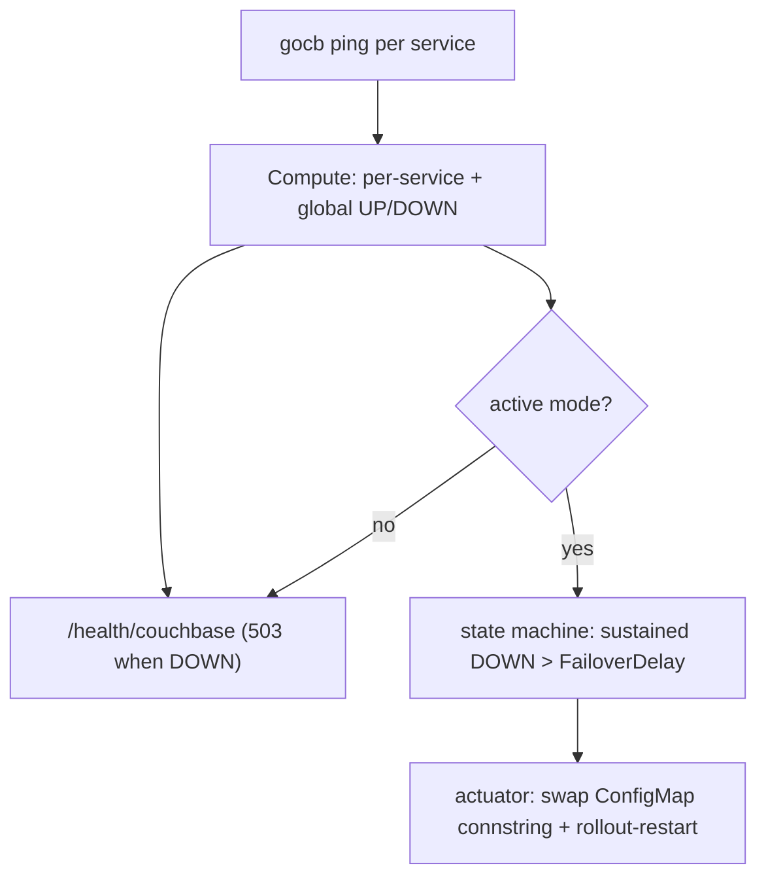

# couchbase-health-observer

A small Go service that watches a Couchbase cluster's health and, optionally, drives
automated multi-region failover on Kubernetes. Built for the Emirates MCA-replacement
engagement.

It detects health with the **SDK per-service** signal: it `ping()`s each Couchbase
service and rolls the results up into a per-service and a global verdict. It runs in
one of two modes:

- **observe** (default) — serve `GET /health/couchbase` only. Something else (a load
  balancer, CloudWatch, an operator) reacts to the status.
- **active** — also run a control loop: when the cluster stays DOWN past a configurable
  `FailoverDelay`, repoint a connection-string ConfigMap to the secondary cluster and
  roll the dependent Deployments so their pods reconnect. Failover is automated;
  **failback is manual**.



## Health model

- A service is **DOWN** if any of its endpoints is unreachable, **UP** only if all are
  reachable. After a Couchbase auto-failover the failed node leaves the cluster map, so
  `ping` reads UP again (the cluster has absorbed the loss).
- The **global** status is `DOWN if any critical service is DOWN, else UP`. `critical`
  is per-app config (e.g. `kv`, or `kv,query`). Non-critical services still appear in
  the JSON for observability.
- There is no `DEGRADED` in the SDK path (the SDK cannot see failover state). Tolerance
  of transient blips lives in the consumer via `FailoverDelay`, not in the snapshot.
- `GET /health/couchbase` returns the detailed JSON report: HTTP 200 when global is UP,
  HTTP 503 when DOWN. `GET /healthz` is a static liveness probe.

Example body:

```json
{
  "status": "UP",
  "critical": ["kv"],
  "services": {
    "kv":    {"status": "UP", "reachable": ["cb-data-1.local:11210"], "unreachable": []},
    "query": {"status": "UP", "reachable": ["cb-index-query-1.local:8093"], "unreachable": []}
  },
  "checkedAt": "2026-06-22T12:00:00Z"
}
```

## Build and run

```bash
go build ./cmd/svchealthcheck                       # build
go run ./cmd/svchealthcheck --conn couchbase://localhost --critical kv   # observe mode
```

> Note: the SDK must be able to reach **every** node's internal address. Against a
> Docker Compose or Kubernetes cluster this means running the observer **inside** that
> network (see below), not from the host.

## Container image

Published multi-arch (`linux/amd64` + `linux/arm64`) to Docker Hub. Tagging policy:

- push to **main** → `edge` + `sha-<sha>` (dev builds; **no `latest`**)
- push a **`vX.Y.Z` tag** → `vX.Y.Z`, `X.Y`, and `latest`

```
docker.io/tayebchlyah/couchbase-health-observer:edge        # latest main build
docker.io/tayebchlyah/couchbase-health-observer:vX.Y.Z      # a release
docker.io/tayebchlyah/couchbase-health-observer:latest      # newest release
```

GitHub Actions (`.github/workflows/docker-publish.yml`) builds/pushes per the policy
above (pull requests build only, no push). Needs repo secrets `DOCKERHUB_USERNAME` and
`DOCKERHUB_TOKEN`. Tagging a `vX.Y.Z` release also generates the changelog and a GitHub
release (`.github/workflows/release.yml`, git-cliff + `cliff.toml`).

Build locally (multi-arch) with buildx:

```bash
docker buildx build --platform linux/amd64,linux/arm64 \
  -t tayebchlyah/couchbase-health-observer:dev --push .
```

### Flags

| Flag | Default | Purpose |
|---|---|---|
| `--mode` | `observe` | `observe` or `active` |
| `--conn` | `couchbase://localhost` | connection string of the primary |
| `--bucket` | `travel-sample` | bucket used for the KV ping |
| `--user` / `--pass` | `Administrator` / `password` | cluster admin credentials |
| `--critical` | `kv` | comma-separated services that drive the global verdict |
| `--addr` | `:8080` | HTTP listen address |
| `--interval` | `5s` | active-mode poll interval |
| `--failover-delay` | `150s` | sustained DOWN before switching; set above the cluster auto-failover timeout |
| `--secondary-conn` | (empty) | connection string to switch to (active mode) |
| `--namespace` | `default` | Kubernetes namespace (active mode) |
| `--configmap` | `cb-conn` | ConfigMap holding the connstring (active mode) |
| `--config-key` | `connstring` | key inside that ConfigMap (active mode) |
| `--deployments` | (empty) | comma-separated Deployments to roll on switch (active mode) |
| `--dry-run` | `false` | active mode: log the switch but make no changes |

Set `GOCB_VERBOSE=1` to enable verbose gocb logging.

In active mode the Kubernetes client uses `KUBECONFIG` if set (local / kind), otherwise
in-cluster config. The observer ServiceAccount needs `get`/`update` on `configmaps` and
`deployments` (see `deploy/kind/observer/rbac.yaml`).

## Manual testing — Docker Compose (observe mode)

The compose harness brings up a 5-node Couchbase EE 8.0.1 cluster (3 data + 2
index/query) plus the observer in **observe** mode, all on one network. This validates
the detector and the auto-failover-absorption behaviour.

```bash
COMPOSE="docker compose -f deploy/compose/docker-compose.yml"

# 1. Bring up the cluster + observer (builds the image; ~90-150s to init + load travel-sample)
$COMPOSE up -d --build

# 2. Baseline: global UP, every service reachable
curl -s localhost:8080/health/couchbase | jq

# 3. Kill a data node -> kv has an unreachable endpoint -> global DOWN (HTTP 503)
docker stop cb-data-2
sleep 10
curl -s localhost:8080/health/couchbase | jq '.status'      # "DOWN"

# 4. Couchbase auto-failover (30s timeout) absorbs the node -> back to UP
#    (the node leaves the cluster map, so ping stops trying to reach it)
sleep 30
curl -s localhost:8080/health/couchbase | jq '.status'      # "UP"

# 5. Tear down (and release host port 8080)
$COMPOSE down -v
```

> If step 2 always returns DOWN: check `lsof -nP -iTCP:8080 -sTCP:LISTEN` for a stray
> host process (e.g. a leftover `go run ./cmd/svchealthcheck` bound to `localhost`)
> squatting on port 8080 and intercepting the curls.

## Manual testing — Kubernetes (kind, active mode)

This exercises the full active path: two single-Helm-release Couchbase clusters in
separate namespaces (`region-a` primary, `region-b` secondary), a mock app reading the
connstring from a ConfigMap, and the observer in active mode. Requires `docker`,
`kind`, `kubectl`, and `helm`.

```bash
ROOT=$(pwd)
KIND=couchbase-health-observer
CHART=deploy/kind/couchbase-cluster

# 1. Create the kind cluster and load the observer image
kind create cluster --name "$KIND" --config deploy/kind/cluster.yaml
docker build -t couchbase-health-observer:dev "$ROOT"
kind load docker-image couchbase-health-observer:dev --name "$KIND"

# 2. Build the pinned official Couchbase operator chart dependency
helm dependency build "$CHART"

# 3. Install each region (common values.yaml is the chart default, layered with the
#    region file). On a cold node the admission webhook may not be ready yet; just
#    re-run the command if it reports "failed calling webhook".
helm upgrade --install region-a "$CHART" -n region-a --create-namespace \
  --values "$CHART/region-a-values.yaml" --wait --timeout 20m
helm upgrade --install region-b "$CHART" -n region-b --create-namespace \
  --values "$CHART/region-b-values.yaml" --wait --timeout 20m

# 4. Wait for both clusters (region-a brings up 5 nodes + rebalance, can exceed 10m)
for r in region-a region-b; do
  kubectl wait --for=condition=Available --timeout=20m -n "$r" "couchbasecluster/$r"
done

# 5. Deploy the mock app and the active observer
kubectl apply -k deploy/kind/mock-app
kubectl apply -k deploy/kind/observer
kubectl rollout status deployment/observer --timeout=2m

# Baseline: the app's ConfigMap points at region-a
kubectl get configmap cb-conn -o jsonpath='{.data.connstring}'   # couchbase://region-a-srv.region-a.svc
```

### Scenario A — single-node loss is absorbed, observer does NOT switch

With 3 data nodes + replica 1 and a 5s auto-failover timeout, losing one node is
absorbed by Couchbase well inside the 30s `FailoverDelay`, so the observer must keep
pointing at region-a.

```bash
# Pause the operator so the deleted pod is not rescheduled (the surviving Couchbase
# nodes are what react), then kill one node.
kubectl patch couchbasecluster region-a -n region-a --type=merge -p '{"spec":{"paused":true}}'
kubectl delete pod region-a-0000 -n region-a --force --grace-period=0

# Watch for ~45s: connstring must stay region-a
for _ in $(seq 1 22); do
  kubectl get configmap cb-conn -o jsonpath='{.data.connstring}'; echo
  sleep 2
done
# Expected: still couchbase://region-a-srv.region-a.svc throughout
```

### Scenario B — full outage triggers the switch

```bash
# Take the rest of region-a down: KV is now unreachable and stays DOWN past FailoverDelay
kubectl delete pod -l couchbase_cluster=region-a -n region-a --force --grace-period=0

# The observer switches the ConfigMap to region-b and rolls the app
kubectl get configmap cb-conn -o jsonpath='{.data.connstring}'   # -> couchbase://region-b-srv.region-b.svc
kubectl rollout status deployment/mock-app --timeout=2m
kubectl logs -l app=mock-app --tail=5                            # logs the region-b connstring

# Useful while debugging
kubectl logs deployment/observer --tail=50

# Tear down
kind delete cluster --name "$KIND"
```

> Cold-start guard: the observer only arms a switch after it has seen the cluster
> healthy at least once. An observer that boots into an already-down primary (e.g. a
> pod reschedule during an outage) will not auto-fail-over on cold start.

## Tests

Tests are grouped by stack under `test/<stack>/`, and each stack is **fully independent** — you can run any one on its own without the others. Infra for each stack lives under the matching `deploy/<stack>/`.

| Stack | Command | Needs | What it does |
|---|---|---|---|
| unit | `go test ./...` | Go only | Unit tests (detector, state machine, actuator). No cluster. |
| compose | `./test/compose/e2e.sh` | Docker | Detector e2e: baseline UP → kill a node → DOWN → auto-failover → UP. Auto-cleans up. |
| kind (render) | `./test/kind/render.sh` | helm, kubectl | Render-only: builds the chart dependency, asserts both regions + manifests template correctly. Fast, no cluster created. |
| kind (switch) | `./test/kind/e2e_switch.sh` | docker, kind, kubectl, helm | Active-mode e2e: installs both regions, scenario A (no switch) + scenario B (switch + rollout). Creates and deletes its own kind cluster. `KEEP_KIND=1` keeps it. |
| kind (switch-lambda) | `./test/kind/switch_lambda_e2e.sh` | kind, kubectl, go | Runs the switch Lambda binary one-shot against kind: a synthetic ALARM flips `cb-conn` to the secondary and rolls the app; an OK event is a no-op. Creates and deletes its own cluster. |
| aws (localstack) | `PHASE=infra\|lambda\|all ./test/aws/localstack.sh` | localstack, awslocal (+ tflocal/go per phase) | Two phases (default `all`): `infra` asserts the aggregation Terraform shapes (TG, internal ALB→listener→TG, quorum alarm dims, SNS); `lambda` deploys the real switch-lambda binary and confirms SNS invokes it. Each phase self-cleans. **Tier:** `lambda` runs on the LocalStack **free tier** (lambda+sns only); `infra`/`all` need an **elbv2-capable tier**. |
| aws (real account) | `VPC_ID=… SUBNET_IDS=…,… ./test/aws/aws.sh` | terraform, aws CLI, authenticated AWS | Real-AWS fidelity: applies the module, registers an unreachable stand-in target (no compute), and confirms `UnHealthyHostCount` → quorum alarm `ALARM` → SNS delivered to a temp SQS queue. Tears everything down (`KEEP=1` to keep). |

Each stack is isolated: `compose` only touches Docker Compose, `kind` only its own kind cluster, `aws` only Terraform/LocalStack or your AWS account. None share state, so they can run in any order or alone.

## Repository layout

```text
pkg/svchealth/        SDK per-service health detector (types, prober, Compute, HTTP handler)
pkg/state/            anti-flap state machine (FailoverDelay, cold-start arm gate)
pkg/actuator/         Kubernetes actuator (ConfigMap swap + rollout-restart)
pkg/event/            parse the SNS-wrapped CloudWatch alarm (switch Lambda)
pkg/switchhandler/    actuate the switch only on ALARM, reusing pkg/actuator (switch Lambda)
cmd/svchealthcheck/   server + active control loop
cmd/switch-lambda/    SNS-triggered Lambda for the distributed-quorum path
deploy/compose/       5-node Couchbase EE 8.0.1 compose harness (compose detector stack)
deploy/kind/          kind cluster, official Couchbase Helm chart wrapper, mock app, observer (kind switch stack)
deploy/aws/           distributed-quorum AWS aggregation: monitoring target group + quorum alarm + SNS (Terraform)
deploy/aws/lambda/    switch Lambda Terraform (SNS subscription + IAM + optional VPC)
test/compose/         compose stack e2e
test/kind/            kind stack render + switch + switch-lambda e2e
test/aws/             aws stack localstack + real-account scripts
HANDOFF.md            running build/handoff log
AGENTS.md             operating rules for any agent working in this repo
```
