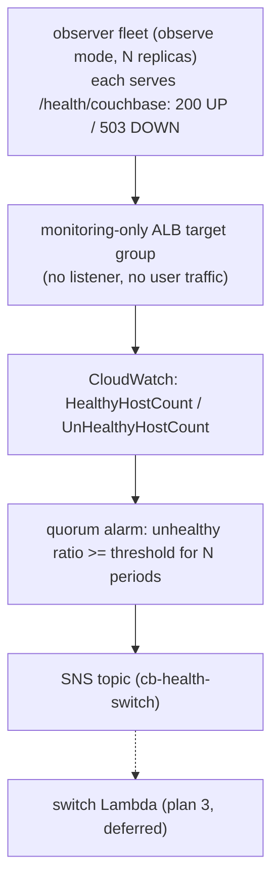

# deploy/aws — distributed-quorum aggregation infra

Terraform for **path 2** of the MCA-replacement actuation (the distributed-quorum
alternative to the single centralized observer). This is the **aggregation layer only**
(plan 2): it turns the per-instance `/health/couchbase` results from the observer fleet
into one quorum decision and publishes it to SNS. The SNS-triggered switch Lambda
(plan 3) is deferred.

## Architecture



- **Detection** is the existing observer running in **observe mode** as a fleet of
  replicas (`k8s/observer-fleet.yaml`), each watching the same primary Couchbase through
  its own SDK connection. We reuse the observer's health endpoint instead of embedding a
  per-app health check.
- **Aggregation/actuation** run on AWS-managed HA primitives, so there is no single
  custom process owning the decision.

Both this stack and the kind switch stack assume the **apps run on Kubernetes/EKS**;
Couchbase itself can stay on AWS VMs (only the connection-string target differs).

## Resources

| File | Resource |
|---|---|
| `target_group.tf` | monitoring-only target group, health-checks `/health/couchbase` (200 healthy / 503 unhealthy), attached to no listener |
| `alarm.tf` | CloudWatch metric-math alarm: `unhealthy / (unhealthy + healthy) >= quorum_threshold` for `sustained_periods`; `treatMissingData = notBreaching`; no `ok_actions` (no auto-failback) |
| `sns.tf` | SNS topic the alarm publishes to (the Lambda will subscribe) |
| `k8s/observer-fleet.yaml` | observe-mode observer Deployment (AZ-spread) + Service |
| `k8s/target-group-binding.yaml` | binds the fleet's pods into the target group (needs the AWS Load Balancer Controller) |

### Variables

| Variable | Default | Meaning |
|---|---|---|
| `name_prefix` | `cb-health` | name prefix for TG / alarm / SNS |
| `vpc_id` | (required) | VPC of the EKS cluster running the fleet |
| `app_port` | `8080` | observer health port |
| `health_path` | `/health/couchbase` | health endpoint |
| `quorum_threshold` | `0.6` | unhealthy ratio at/above which the cluster is DOWN by quorum |
| `sustained_periods` | `2` | consecutive 1-minute periods the quorum must hold (anti-flap) |

## Test on LocalStack (shape/flow)

Proves the Terraform applies and the resources have the right shape. Does **not** prove
real ALB metric emission (LocalStack limitation).

Requires Docker, LocalStack **Pro** (ELBv2 + CloudWatch are Pro), and the wrappers:

```bash
pip install terraform-local awscli-local
LOCALSTACK_AUTH_TOKEN=... localstack start -d
./test/aws/localstack.sh
```

## Apply + fidelity check (AWS sandbox)

This is the real-AWS check LocalStack cannot give, and the demo for Emirates.

```bash
cd deploy/aws
terraform init
terraform apply -var vpc_id=<sandbox-vpc> -var name_prefix=cb-health
```

Deploy the observer fleet and bind it into the target group (substitute the ARN):

```bash
# fleet: edit k8s/observer-fleet.yaml first (ECR image + primary Couchbase --conn)
kubectl apply -f k8s/observer-fleet.yaml

TG=$(terraform output -raw monitoring_target_group_arn)
sed "s#TARGET_GROUP_ARN#${TG}#" k8s/target-group-binding.yaml | kubectl apply -f -
```

Fidelity check:

1. Confirm the fleet pods register: `aws elbv2 describe-target-health --target-group-arn $TG`.
2. Force a quorum of observers to report DOWN (kill enough primary Couchbase nodes past
   tolerance so `/health/couchbase` returns 503 on a majority of the fleet).
3. Watch `UnHealthyHostCount` rise for the target group in CloudWatch.
4. Confirm the alarm latches to ALARM after `sustained_periods` minutes:
   `aws cloudwatch describe-alarms --alarm-names cb-health-quorum-down`.
5. Confirm a message lands on the SNS topic (subscribe a temporary SQS queue or email).

This is the gate before wiring plan 3's switch Lambda.

## Open questions (carried from the design)

- Does a monitoring-only target group (no listener) reliably emit `UnHealthyHostCount`?
- Right `quorum_threshold` + `sustained_periods` vs false positives.
- `treatMissingData`: a whole-region/AZ outage zeros out hosts; "cannot tell" is
  non-actionable here. A minimum-healthy-host floor may be added as a second condition.
