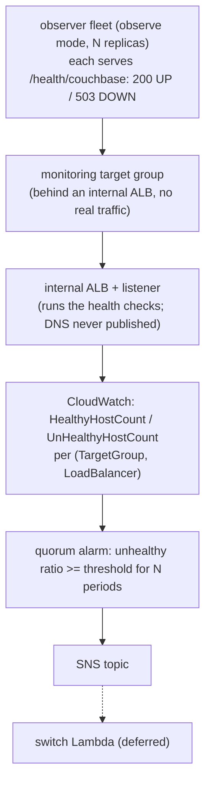

# deploy/aws — distributed-quorum aggregation infra

Terraform for the distributed-quorum failover path: instead of one centralized observer
owning the decision, run the observer health endpoint as a fleet and let AWS-managed
primitives aggregate the result. This module is the **aggregation layer**: it turns the
per-instance `/health/couchbase` results into one quorum decision and publishes it to an
SNS topic. The SNS-triggered switch Lambda (the actuation) is a separate, later piece.

## Architecture



- **Detection** is the observer running in **observe mode** as a fleet of replicas
  (`k8s/observer-fleet.yaml`), each watching the same primary cluster through its own SDK
  connection. We reuse the observer's health endpoint rather than embedding a per-app
  health check.
- **Aggregation** runs on AWS-managed HA primitives, so no single custom process owns the
  decision.

> **Why the internal ALB?** AWS only health-checks and emits `Healthy/UnHealthyHostCount`
> for a target group **attached to a load balancer**. A standalone target group reports
> its targets as `unused` and emits no metrics. So the module creates an **internal** ALB
> with a listener that forwards to the monitoring target group; the ALB carries no real
> user traffic (its DNS is never published) and exists only to drive the health checks.
> The metrics are keyed by **(TargetGroup, LoadBalancer)**, so the alarm must include both
> dimensions — a TargetGroup-only alarm sees no data and never fires. Both points were
> confirmed empirically on a real AWS account.

This stack assumes the **apps run on Kubernetes/EKS**; the database itself can run
elsewhere (only the connection-string target differs).

## Resources

| File | Resource |
|---|---|
| `target_group.tf` | monitoring target group, health-checks `/health/couchbase` (200 healthy / 503 unhealthy) |
| `alb.tf` | internal ALB + HTTP listener forwarding to the target group, and its security group (so AWS runs the health checks and emits metrics) |
| `alarm.tf` | CloudWatch metric-math alarm: `unhealthy / (unhealthy + healthy) >= quorum_threshold` for `sustained_periods`, keyed by (TargetGroup, LoadBalancer); `treatMissingData = notBreaching`; no `ok_actions` (no auto-failback) |
| `sns.tf` | SNS topic the alarm publishes to (the switch Lambda will subscribe) |
| `k8s/observer-fleet.yaml` | observe-mode observer Deployment (AZ-spread) + Service |
| `k8s/target-group-binding.yaml` | binds the fleet's pods into the target group (needs the AWS Load Balancer Controller) |

### Variables

| Variable | Default | Meaning |
|---|---|---|
| `name_prefix` | `cb-health` | name prefix for the resources |
| `vpc_id` | (required) | VPC of the EKS cluster running the fleet |
| `subnet_ids` | (required) | >= 2 subnets in different AZs for the internal ALB |
| `app_port` | `8080` | observer health port |
| `health_path` | `/health/couchbase` | health endpoint |
| `quorum_threshold` | `0.6` | unhealthy ratio at/above which the cluster is DOWN by quorum |
| `sustained_periods` | `2` | consecutive 1-minute periods the quorum must hold (anti-flap) |

The observer pods' security group must allow inbound on `app_port` from the ALB security
group (output `monitoring_alb_security_group_id`) so the health checks reach them.

## Test on LocalStack (shape/flow)

Proves the Terraform applies and the resources have the right shape (target group, ALB +
listener → TG, alarm with both dimensions, SNS). It does **not** prove real ALB metric
emission (LocalStack limitation) — that is the AWS check below.

Requires Docker and LocalStack with a license tier that **includes `elbv2`** (plus
`cloudwatch` and `sns`). The freemium tier excludes `elbv2`, so the apply fails on the
target group with `501 ... elbv2 service is not included within your LocalStack license`.

```bash
pip install terraform-local awscli-local
localstack auth set-token <token>   # or export LOCALSTACK_AUTH_TOKEN=...
localstack start -d
./test/aws/localstack.sh             # creates an ephemeral VPC + subnets, asserts, tears down
```

## Apply + fidelity check (AWS account)

The real-AWS check LocalStack cannot give, and the basis for a live demo.

> No account-specific settings are committed. Provide auth/region via your AWS CLI config
> (`AWS_PROFILE` / `AWS_REGION` / SSO) and the VPC/subnets via `-var`, or an **untracked**
> tfvars file (`*.auto.tfvars` is gitignored).

```bash
cd deploy/aws
terraform init
terraform apply \
  -var vpc_id=<your-vpc> \
  -var 'subnet_ids=["<subnet-a>","<subnet-b>"]' \
  -var name_prefix=cb-health
```

Deploy the observer fleet and bind it into the target group:

```bash
# fleet: edit k8s/observer-fleet.yaml first (image + primary cluster --conn)
kubectl apply -f k8s/observer-fleet.yaml

TG=$(terraform output -raw monitoring_target_group_arn)
sed "s#TARGET_GROUP_ARN#${TG}#" k8s/target-group-binding.yaml | kubectl apply -f -
```

Fidelity check:

1. Confirm the fleet pods register: `aws elbv2 describe-target-health --target-group-arn $TG`.
2. Force a quorum of observers to report DOWN (take the primary cluster down past
   tolerance so `/health/couchbase` returns 503 on a majority of the fleet).
3. Watch `UnHealthyHostCount` rise for the target group (dimensions TargetGroup +
   LoadBalancer) in CloudWatch.
4. Confirm the alarm latches to ALARM after `sustained_periods` minutes:
   `aws cloudwatch describe-alarms --alarm-names cb-health-quorum-down`.
5. Confirm a message lands on the SNS topic (subscribe a temporary SQS queue or email).

This is the gate before wiring the switch Lambda.

### Validation status

The full chain was validated on a real AWS account using an unreachable stand-in target
(no compute): the target went `unhealthy`, `UnHealthyHostCount` emitted, the alarm latched
to ALARM after the sustained window, and the SNS notification was delivered. The module
applies and destroys cleanly on real AWS.

## Open questions

- Right `quorum_threshold` + `sustained_periods` for the target environment vs false positives.
- `treatMissingData`: a whole-region/AZ outage zeros out hosts; "cannot tell" is
  non-actionable here. A minimum-healthy-host floor may be added as a second condition.
