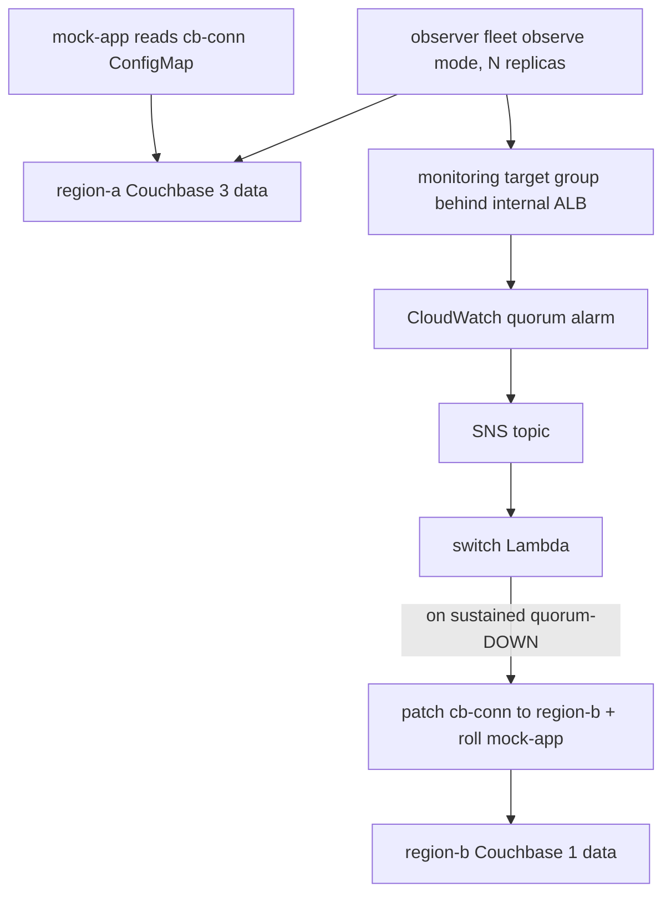

# deploy/aws/eks-demo — full Path-2 demo on EKS (Terraform)

Stands up the entire distributed-quorum failover architecture on a real EKS cluster:



Components (all Terraform): VPC + EKS + managed node group, AWS Load Balancer Controller,
2 Couchbase clusters via the official Operator chart (region-a primary 3 data, region-b
secondary 1 data), the mock app, the observer fleet (image
`tayebchlyah/couchbase-health-observer`), the reused aggregation module (target group +
internal ALB + quorum alarm + SNS), and the reused switch Lambda (authenticating to EKS
via its IAM role through an access entry).

## Prerequisites

- The observer image repo on Docker Hub must be **public** (the EKS nodes pull it).
- `terraform`, `aws`, `kubectl`, `go`, AWS creds (`AWS_PROFILE` / `AWS_REGION`).

## Apply

EKS + Helm in one config needs a two-phase apply (the Kubernetes/Helm providers depend on
the cluster created here):

```bash
cd deploy/aws/eks-demo
../lambda/build.sh                 # build the lambda binary (archive needs it at plan time)
terraform init

# Phase 1: cluster first
terraform apply -target=module.vpc -target=module.eks

# Phase 2: everything else (ALB controller, Couchbase, app, observer, aggregation, lambda)
terraform apply

aws eks update-kubeconfig --name "$(terraform output -raw cluster_name)" --region "$(terraform output -raw region)"
```

If a Couchbase release fails on the admission-webhook startup race (`failed calling
webhook ... connection refused`), just re-run `terraform apply` — it is idempotent.

## Verify it is healthy

```bash
kubectl -n region-a get pods            # 3 data pods Ready
kubectl -n region-b get pods            # 1 data pod Ready
kubectl get pods -l app=cb-observer-health   # N observer replicas Ready
kubectl get configmap cb-conn -o jsonpath='{.data.connstring}'   # region-a
# target group health (should be healthy once observers register):
aws elbv2 describe-target-health --target-group-arn "$(terraform output -raw monitoring_target_group_arn)"
```

## Drive the demo (force a region switch)

Take region-a down so a quorum of observers report DOWN:

```bash
kubectl patch couchbasecluster region-a -n region-a --type=merge -p '{"spec":{"paused":true}}'
kubectl delete pod -n region-a -l couchbase_cluster=region-a --force --grace-period=0
```

Then watch the pipeline (allow ~3-5 min for the CloudWatch quorum alarm; see the failover
latency note in the design doc):

```bash
# alarm latches:
watch aws cloudwatch describe-alarms --alarm-names "$(terraform output -raw quorum_alarm_name)" --query 'MetricAlarms[0].StateValue'
# the Lambda flips the ConfigMap to region-b:
watch kubectl get configmap cb-conn -o jsonpath='{.data.connstring}'
# and rolls the app onto region-b:
kubectl rollout status deployment/mock-app
kubectl logs -l app=mock-app --tail=5     # connstring=...region-b...
kubectl logs "$(terraform output -raw lambda_function_name)" 2>/dev/null || \
  aws logs tail "/aws/lambda/$(terraform output -raw lambda_function_name)" --since 10m
```

Failback is manual: set the ConfigMap back to region-a and unpause/recover region-a.

## Teardown

```bash
terraform destroy
```

> Cost: this runs an EKS control plane, a node group, a NAT gateway, an internal ALB, and
> two Couchbase clusters. Destroy when you are done.
